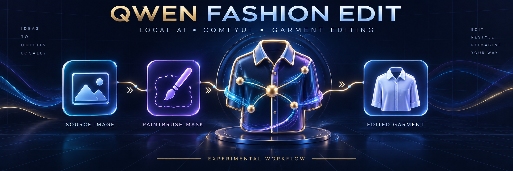
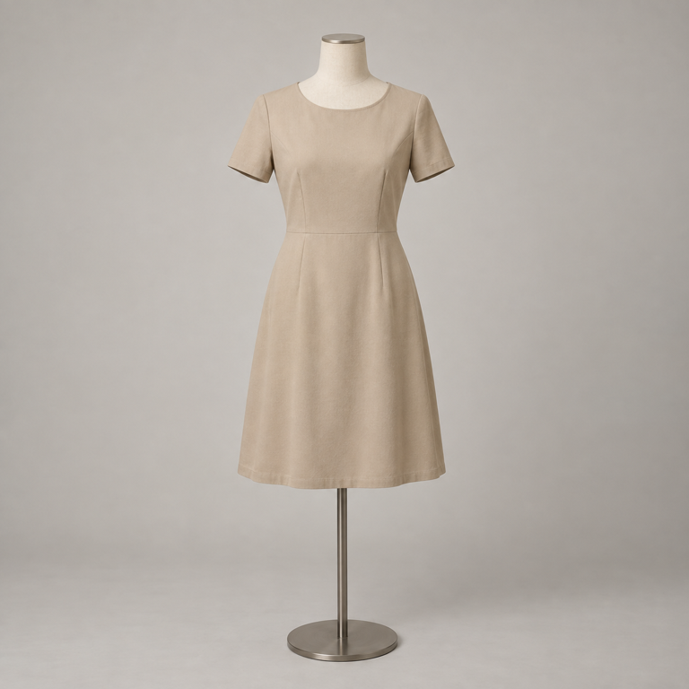
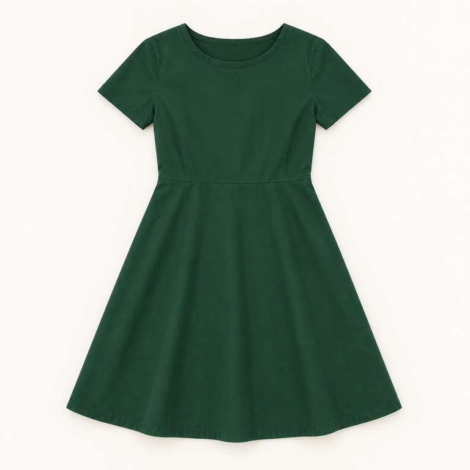
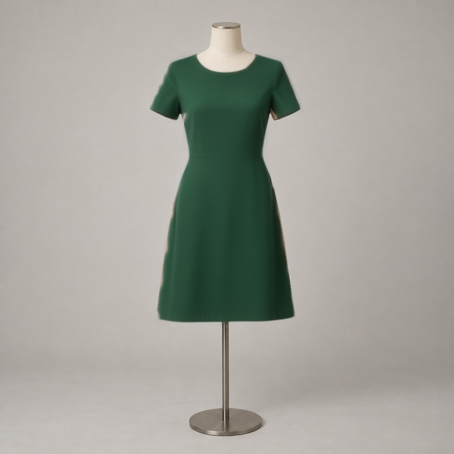
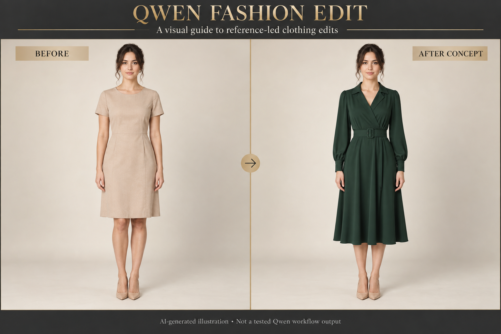
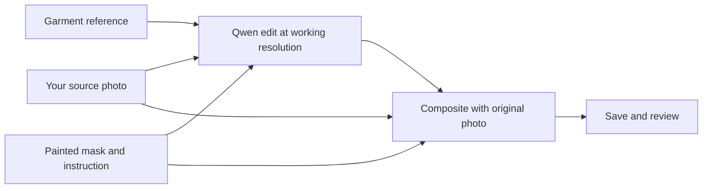

<div align="center">

# ✦ Qwen Fashion Edit

### Local AI clothing edits · ComfyUI workflow · Reference-guided experiments


**Your photo. Your garment reference. A carefully chosen edit area.**

[**Download workflow ↓**](https://github.com/binaya-cmd/qwen-fashion-edit-workflow/raw/refs/heads/main/workflows/low-budget/Qwen_Fashion_Edit_3060.json) · [**Full overview**](docs/project-overview.md) · [**Hardware & costs**](docs/hardware-guide.md) · [**Troubleshooting**](docs/troubleshooting.md)

</div>

| 🖼️ **YOUR IMAGES** | 🎨 **YOUR EDIT AREA** | 🧠 **LOCAL GENERATION** | 👗 **REVIEW THE RESULT** |
| :---: | :---: | :---: | :---: |
| Source photo + garment reference | Paint a focused clothing mask | Run the Qwen graph in ComfyUI | Inspect garment details and edges |

## 🧪 Actual Qwen workflow example

| Synthetic input | Garment reference | Actual Qwen output |
| :---: | :---: | :---: |
|  |  |  |

**One local run · RTX 3060 12 GB · 20 steps · about 11m 40s including model loading.** The output was not retouched. All zero-mask pixels matched the source exactly. Small beige remnants and soft/clipped garment edges remain; fine fabric details differ from the reference. This is a pipeline demonstration, not proof of product-perfect transfer. [Inputs, mask and test prompt](examples/README.md) · [Environment, measurements and limitations](docs/validation.md).

## ✨ See the concept



> **Illustrative preview:** this original AI-generated image explains the intended clothing transition. It is **not an output from the published Qwen workflow** and is not a quality benchmark. No client images were used. [Asset provenance](ASSET-MANIFEST.md).

---

## ◈ What is Qwen Fashion Edit?

A local Qwen workflow for experimenting with everyday garment edits using a source photo, product reference and painted clothing mask.

**You provide two images and choose the clothing area. The workflow generates an edited garment region, then combines it with your original photograph.** It is intended for creators learning ComfyUI, fashion concept exploration, and e-commerce teams evaluating AI-assisted editing.

For a detailed explanation, start with the **[public project overview](docs/project-overview.md)**. It covers the complete process, examples, limitations, privacy, and common questions. For equipment choices and operating costs, read the **[hardware and cost guide](docs/hardware-guide.md)**.

**Status: experimental workflow starter.** The low-budget JSON is now included and structurally checked. One synthetic mannequin run completed on an RTX 3060 12 GB. The result demonstrates pipeline execution and a garment-color change, with visible edge limitations. It is not a general quality or speed benchmark. [Measured report](docs/validation.md). This project is independent of Qwen and ComfyUI.

## ✓ What you need before starting

| Requirement | What to have ready |
| --- | --- |
| **ComfyUI** | A working installation with Qwen Image Edit 2511 core nodes |
| **GPU and memory** | Budget target: **NVIDIA RTX 3060 12 GB**. The tested setup used 32 GB system RAM; this is not a proven minimum or a memory-fit guarantee. Other setups remain unvalidated. |
| **Disk space** | Enough for all three model files, the ComfyUI environment, temporary downloads and outputs. Check actual download sizes before starting. |
| **GGUF extension** | `city96/ComfyUI-GGUF`, installed into the same ComfyUI environment |
| **Three model files** | The GGUF diffusion model, text/image encoder and VAE listed below |
| **Your inputs** | One source photograph, one everyday garment reference, and a mask you paint in ComfyUI |
| **Initial internet access** | Needed to obtain software and models. The supplied generation graph uses local model nodes. |

**New to the terms?** ComfyUI is the visual application that runs the workflow. A *node* performs one step. The *model* generates the edit, the *encoder* interprets the prompt and images, and the *VAE* converts between pixels and the model's internal image representation. A *mask* marks where the edit may appear. A *GGUF* file is a quantized model file that needs the matching loader.

## ⚙ Installation — from download to first run

### 1 · Install and start ComfyUI

For Windows/NVIDIA, follow the [official portable installation guide](https://docs.comfy.org/installation/comfyui_portable_windows). Extract ComfyUI into its own folder, start its NVIDIA launcher and confirm that the console detects your GPU. Keep ComfyUI and your private images outside your copy of this GitHub repository.

For other environments, use the [official manual installation guide](https://docs.comfy.org/installation/manual_install). This project has not validated CPU-only, Apple or other GPU configurations.

### 2 · Add the GGUF loader

Follow the installation instructions in [city96/ComfyUI-GGUF](https://github.com/city96/ComfyUI-GGUF). The extension belongs under `ComfyUI/custom_nodes/ComfyUI-GGUF`. Install its requirements using the Python environment that runs ComfyUI—not an unrelated system Python—then restart ComfyUI. The workflow needs its **UnetLoaderGGUF** node.

### 3 · Download these exact model files

| Component | Filename | Download source |
| --- | --- | --- |
| **Diffusion model** | `qwen-image-edit-2511-Q4_K_M.gguf` | [Unsloth GGUF files](https://huggingface.co/unsloth/Qwen-Image-Edit-2511-GGUF/tree/main) |
| **Text/image encoder** | `qwen_2.5_vl_7b_fp8_scaled.safetensors` | [Comfy-Org encoder files](https://huggingface.co/Comfy-Org/Qwen-Image_ComfyUI/tree/main/split_files/text_encoders) |
| **VAE** | `qwen_image_vae.safetensors` | [Comfy-Org VAE files](https://huggingface.co/Comfy-Org/Qwen-Image_ComfyUI/tree/main/split_files/vae) |

Place them in this structure:

```text
ComfyUI/
├── custom_nodes/
│   └── ComfyUI-GGUF/
└── models/
    ├── diffusion_models/
    │   └── qwen-image-edit-2511-Q4_K_M.gguf
    ├── text_encoders/
    │   └── qwen_2.5_vl_7b_fp8_scaled.safetensors
    └── vae/
        └── qwen_image_vae.safetensors
```

The GGUF is third-party quantized packaging. Review the source and license of each component. No weights are included here. Do not substitute the BF16 model into the GGUF loader or rename files to make them appear compatible. **No LoRA is required** by this baseline. See [model details](docs/model-downloads.md).

### 4 · Load the workflow

Download **[Qwen_Fashion_Edit_3060.json](https://github.com/binaya-cmd/qwen-fashion-edit-workflow/raw/refs/heads/main/workflows/low-budget/Qwen_Fashion_Edit_3060.json)**. If viewing its GitHub file page, use **Download raw file**. Drag the saved JSON onto the ComfyUI canvas, then select the exact installed filenames in the model, encoder and VAE loaders.

Missing `UnetLoaderGGUF` usually means the extension did not load. Missing `TextEncodeQwenImageEditPlus`, `CFGNorm` or `FluxKontextMultiReferenceLatentMethod` requires checking your ComfyUI version and startup errors. The [upstream tutorial](https://docs.comfy.org/tutorials/image/qwen/qwen-image-edit-2511) describes the Qwen core-node setup.

### 5 · Supply your images and paint the mask

1. **Node 1:** upload your source photo.
2. **Node 2:** upload your garment product reference.
3. Right-click the source image, open **MaskEditor**, paint the clothing region that should change, and save the mask. Leave the face, hair and other details you want preserved outside it.
4. **Node 9:** review the general fashion instruction and adjust it for your garment.
5. Start with the supplied **0.5 MP, 20 steps, CFG 4, Euler/simple and one image**. Use a modest-size reference too.
6. Press **Run** and inspect the result. Outputs are saved in ComfyUI's output folder with the `Qwen_Fashion_Edit` prefix.

An empty mask returns an unchanged source in the final composite. If the new garment extends beyond the old outline, the mask must cover that intended area. See the [complete workflow guide](workflows/low-budget/README.md) for settings and limitations.

<details>
<summary><strong>Windows portable: optional low-memory launch command</strong></summary>

Run from the portable installation's root folder after dependencies are installed:

```bat
python_embeded\python.exe -s ComfyUI\main.py --windows-standalone-build --lowvram --preview-method none --listen 127.0.0.1 --port 8188
```

Open the local address printed in the console. Do not start another instance on the same port. Low-VRAM mode is a starting configuration, not a guarantee that every workload fits.

</details>

## ↗ Reading paths

1. Read the [hardware guide](docs/hardware-guide.md).
2. Follow [installation](docs/installation.md) and obtain the exact files in [model downloads](docs/model-downloads.md).
3. Download [Qwen_Fashion_Edit_3060.json](workflows/low-budget/Qwen_Fashion_Edit_3060.json) using **Download raw file** and drag it into ComfyUI.
4. Follow the [workflow instructions](workflows/low-budget/README.md) to supply two images and paint a mask.
5. Review the output and consult [troubleshooting](docs/troubleshooting.md).

### What you receive

| Included | You supply separately |
| --- | --- |
| ComfyUI workflow JSON: a saved arrangement of nodes and settings | A working ComfyUI installation and compatible GPU/runtime |
| Generic fashion-edit instruction and manual mask process | Your own source photo, garment reference and painted mask |
| Model filenames, source links and installation guidance | Model downloads and the GGUF extension |
| Hardware planning and troubleshooting guidance | Local electricity/hardware or any cloud rental costs |

This is a workflow you load into ComfyUI, not a hosted image editor or a standalone application. Downloading the JSON alone does not install the model. No paid API is used by the supplied graph.

### Example use

Suppose you have permission to edit a photograph of a person wearing a plain shirt and you have a product photograph of a blue everyday shirt. Load those two images, paint the shirt region, and ask the workflow to match the reference garment. Review the generated result against the actual product. This describes the intended process; it is not a published test result.

## ◇ How the edit works



The graph edits a painted garment region and composites it over the original source. Zero-mask areas retain source pixels; soft edges blend. Outputs keep the original dimensions, but the edited region is generated at a lower working resolution. Inspect fabric, seams, fit, logos, color and face consistency before using an output in a product listing.

## ▦ Choose a setup path

| Setup | Intended use | Status |
| --- | --- | --- |
| RTX 3060 12 GB | GGUF Q4_K_M, reduced working resolution and offloading | One synthetic mannequin run completed; approximately 11m 40s including model loading; see validation |
| RTX A6000 / A40 48 GB | More memory headroom locally or on rented hardware | Comparison not benchmarked; cloud processing is remote |
| Larger-memory configurations | Evaluate after a measured need | Research only |

## ♧ Privacy and public scope

General fashion and e-commerce examples only. The public baseline uses generic prompts and placeholder input filenames. Client images, model weights, credentials, confidential prompts and proprietary paid workflows remain outside the repository and its history. The front-page illustration was created separately to explain the concept; a separate synthetic mannequin input/reference/output demo is now included with measured test notes. Model downloads and installation are manual.

The [pro folder](workflows/pro-placeholder/README.md) remains a documentation placeholder. External models and software retain their own licenses; original repository material is provided under the [MIT License](LICENSE).

## ◷ What is verified—and what comes next?

- [x] Add a public baseline graph and check its links and public-facing content.
- [x] Complete one generation run with original synthetic mannequin assets.
- [x] Record software commits, model hashes, sampled memory and one cold execution time.
- [x] Publish the unretouched test output, inputs and asset manifest.
- [ ] Measure repeated warm runs and test more garment shapes, poses and mask boundaries.
- [ ] Compare a high-memory setup using the same inputs and settings.

See the [measured validation report](docs/validation.md) for what must be measured before stronger performance claims can be made.
