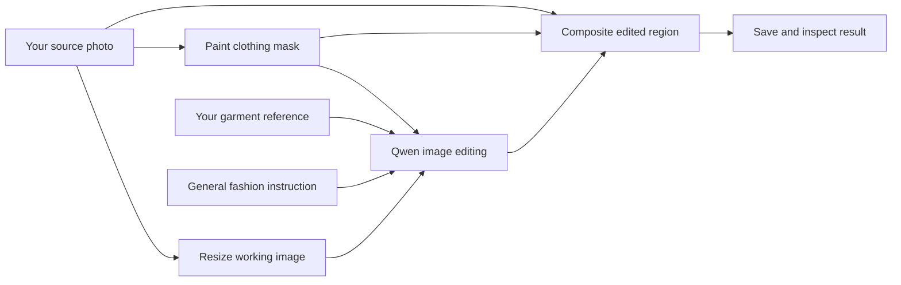

# Public project overview

## What is this project?

This project shares an experimental ComfyUI workflow for editing everyday clothing in a photograph with guidance from a second garment image. The model family is Qwen-Image-Edit-2511. The public budget configuration uses a third-party GGUF Q4_K_M quantization, an image/text encoder and a VAE.

Think of the workflow as a recipe: it describes which components to load, how images move between them, which settings to use, and where to save the result. The JSON contains the recipe, not the model weights or anyone's photographs.

The project is for people willing to install and learn ComfyUI. A fashion creator can explore an outfit concept; an editor can evaluate reference-guided garment changes; a developer can inspect and extend the graph. For product listings, generated details must be checked against the real garment. This is not a sizing system, a fabric simulation, or a guarantee that the depicted fit is physically accurate.

## The process at a glance

1. **Source photo:** the picture to edit. Use an image you own or have permission to process.
2. **Garment reference:** a separate picture showing the everyday garment you want to use as guidance. Clear, unobstructed views make manual comparison easier.
3. **Mask:** a painted map of the area allowed to change. The public workflow requires you to paint it; it does not automatically detect clothing.
4. **Instruction:** a short description of the intended edit. It helps guide the model but does not enforce exact product reconstruction.
5. **Generation:** Qwen produces an edited region using the images, instruction and sampler settings.
6. **Composite:** the generated region is resized to the source dimensions and blended into the original using the mask.
7. **Review:** compare the output with both inputs before saving it for any practical use.

## What stays the same, and what can change?

The final composite copies pixels from the original wherever the mask is zero. Soft mask edges blend original and generated pixels. This preserves an unmasked face or background through compositing, rather than relying only on a prompt. If you paint over a face or other detail, it can change.

Inside the mask, the model synthesizes content. It can alter seams, buttons, prints, folds, shape, texture and color. The prompt asks for fidelity, but the graph cannot certify that the output is an exact depiction of the reference product. Review at full size, especially boundaries near hands, hair and accessories.

A new garment extending beyond the old silhouette needs a mask covering that intended outline. A mask that is too narrow may clip the new garment. A mask that is too broad permits unwanted changes. An empty mask returns the original picture in the final composite; it is not evidence of a successful edit.

## Intended experiments and limits

| Experiment | What to try | What to check |
| --- | --- | --- |
| Everyday garment replacement | Source outfit plus a clear shirt, dress or jacket reference | Silhouette, sleeves, seams, occlusion and continuity |
| Color exploration | A matching garment reference in the desired color and a focused instruction | Lighting, shadows and actual product color |
| Fabric or pattern concepts | A reference that clearly shows the desired material | Repeated patterns, texture scale and invented details |
| Learning local AI editing | Small working image, one output, fixed seed | Whether dependencies load and the edit is reproducible |

The mannequin color edit and fictional-adult party-dress example demonstrate two limited cases. Broader experiments still need their own evaluation. A general image-editing model is not a specialist fit predictor. There is no automatic segmentation, batch-processing interface, native 4K generation, measurement-based sizing, or dedicated super-resolution stage in this baseline. More elaborate editing systems would need separate components and validation.

## First-run checklist

Follow [installation](installation.md), then the [node-by-node usage guide](../workflows/low-budget/README.md). Before pressing Run, confirm that all three model loaders have real installed files selected, both image nodes contain your own images, and the clothing mask is saved.

Start with the supplied 0.5-megapixel working resolution and one image. Use a modest reference image too: the reference is not explicitly resized by this graph. Keep the initial sampler settings unchanged until the first run completes. Then vary one setting at a time and record it.

ComfyUI saves results under its own output directory with the `Qwen_Fashion_Edit` prefix. The output retains the source dimensions, but the edited patch is generated at the lower working resolution. Enlarging that patch does not create native high-resolution detail.

## Where images go

Opening the GitHub JSON does not display or download a client's input or output photographs. It contains generic input placeholders. You must choose your own images in ComfyUI.

In a local setup, uploading through ComfyUI's local interface sends the image to the ComfyUI process on your own machine. The supplied graph uses local model nodes and does not upload to GitHub or call a paid image API. Extensions can have their own network behavior. Downloading models and installing software generally needs an internet connection; having all dependencies available locally is a separate condition from simply downloading this repository.

On a rented cloud machine, inputs are sent to that remote machine. Cloud inference should not be described as offline or local-to-your-device. Before sharing any output publicly, check its visible content and metadata; saved ComfyUI images can carry workflow information.

## Budget versus higher-memory setups

The budget path uses quantized weights to reduce the model's storage/memory burden and a smaller working image to control workload. Offloading moves some work or data between GPU and system memory. It can help fit a workload but introduces transfer overhead; actual behavior depends on the runtime and graph.

A 48 GB GPU offers more memory capacity, which may allow different precision or larger workloads after testing. It does not automatically make the same output more accurate, nor does it guarantee that an arbitrary full-precision graph fits. The public repository includes one budget graph, not separately tested graphs for every hardware row. See [hardware and cost](hardware-guide.md).

## Common questions

**Is it free?** The repository is available under its existing MIT license. Hardware, electricity, storage and optional cloud rental have costs. Model and dependency licenses are separate. There is no paid API node in the supplied graph.

**Can I just double-click the JSON?** Load it inside ComfyUI after installing the required components. It is not an executable installer.

**Do I need a product reference?** Yes. The supplied graph is wired for a source image and a second reference image. A prompt-only route would be a different configuration.

**Does it automatically find the clothing?** No. Paint the mask using MaskEditor.

**Can I use an 8 GB GPU or a laptop?** This project has not validated those configurations. The stated budget target is specifically the RTX 3060 12 GB. GPU memory, system memory and runtime support all matter.

**Does it run on CPU or Apple hardware?** No such environment is validated here. Follow upstream support guidance and do not assume the NVIDIA budget instructions apply unchanged.

**Is there a before-and-after gallery?** The primary front-page example is now an [actual Qwen party-dress edit of a fictional adult](../examples/HUMAN-PARTY.md), with the plain-dress source, garment reference and unretouched output. The front page has one separately AI-generated before-and-after concept illustration. It was not generated by the published Qwen graph and is not evidence of its performance. No client/model photographs are included. A separate [synthetic mannequin example](../examples/README.md) now includes the actual Qwen output, inputs, mask and test instruction. See the [asset manifest](../ASSET-MANIFEST.md).

**Is the workflow tested?** Its JSON structure and typed connections have been checked. Prior local setup checks recognized the baseline's model files and graph inputs. Its API representation completed a documented synthetic mannequin run and a separate fictional-adult party-dress run on RTX 3060 12 GB; the test retained graph links and baseline settings, changing only inputs, instruction and output prefix. The interactive UI import/mask-painting flow and broader quality remain unvalidated. See [mannequin validation](validation.md) and [human-example validation](human-validation.md).

**What does the pro placeholder contain?** General high-memory planning notes only. It does not contain the private commercial workflow.

## Upstream references

- [Official Qwen-Image-Edit-2511 ComfyUI tutorial](https://docs.comfy.org/tutorials/image/qwen/qwen-image-edit-2511)
- [Qwen model card](https://huggingface.co/Qwen/Qwen-Image-Edit-2511)
- [Unsloth GGUF packaging](https://huggingface.co/unsloth/Qwen-Image-Edit-2511-GGUF)
- [ComfyUI-GGUF loader](https://github.com/city96/ComfyUI-GGUF)

These identify upstream components; their examples and claims are not benchmark results for this repository.
