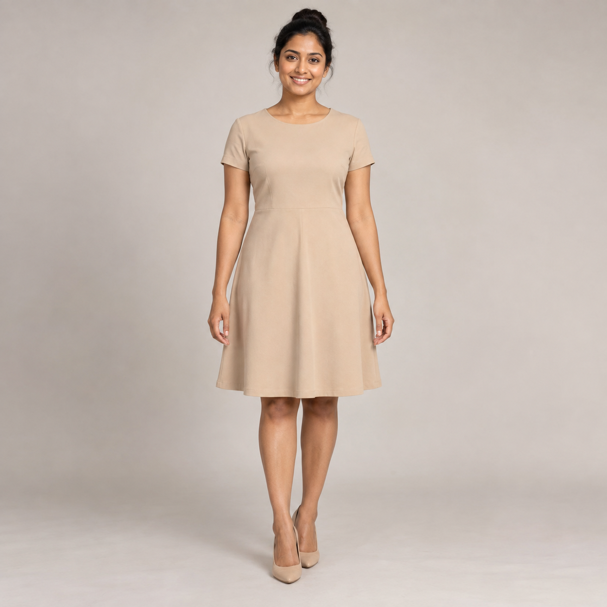
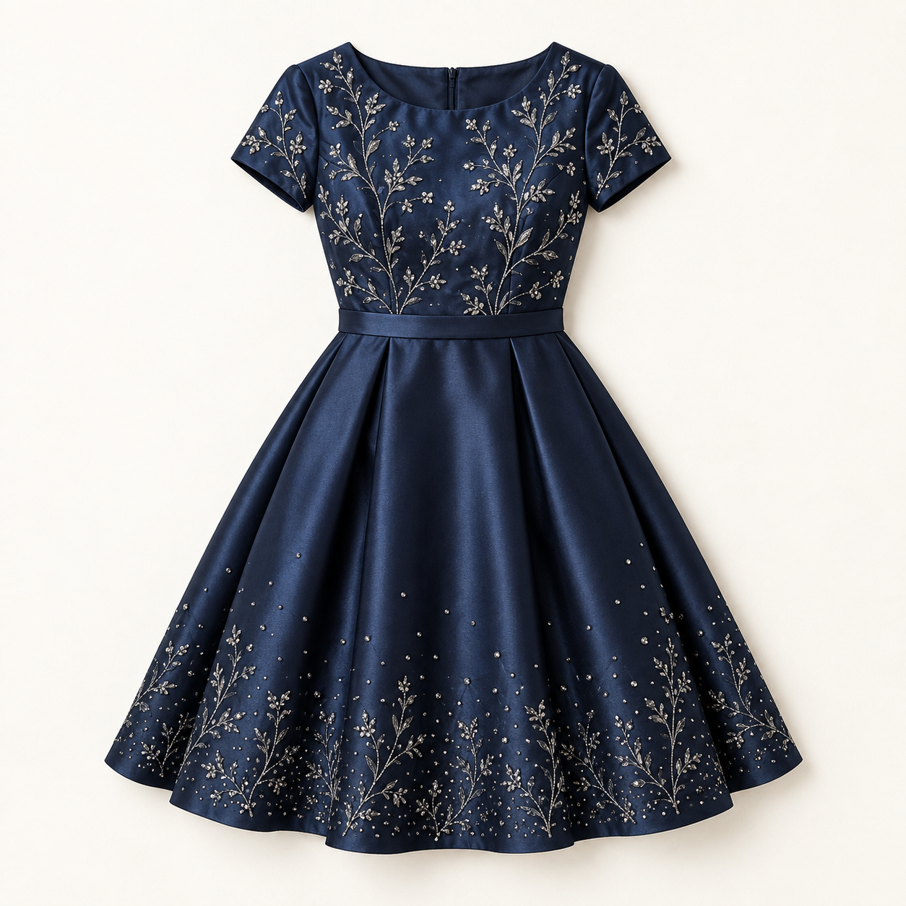
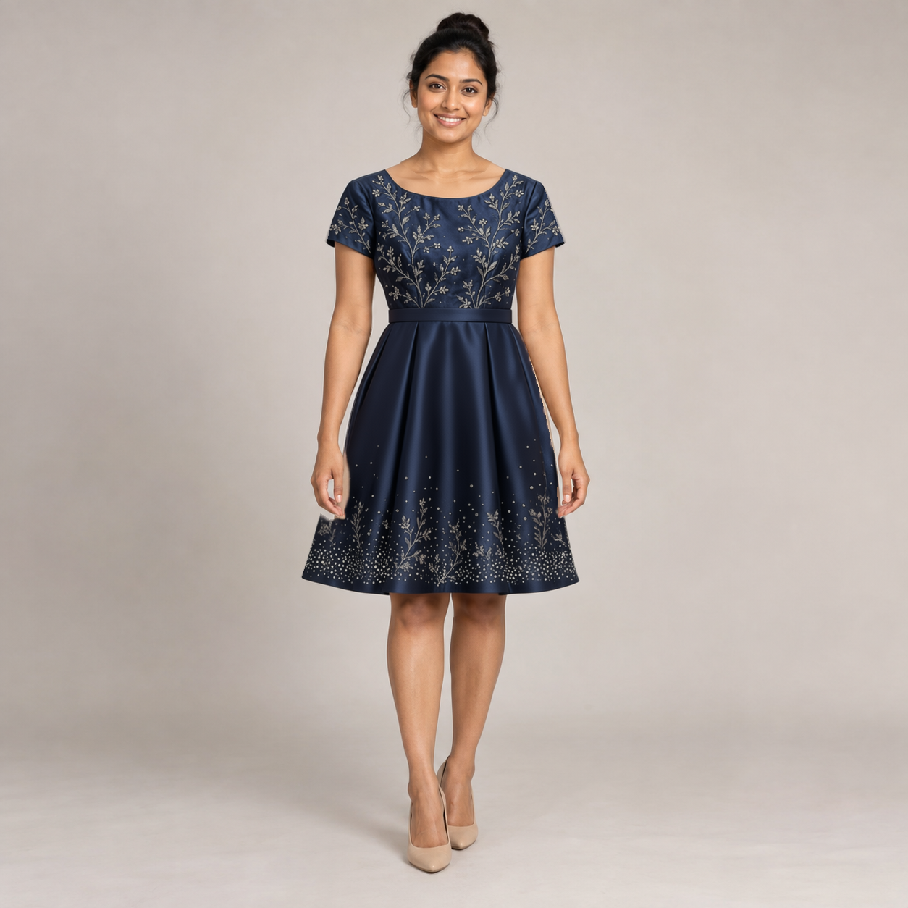

# Higher-detail dress transfer: crop, reference detail and edge repair

This recorded experiment addresses the earlier human example's missing embroidery and rough boundary. The main canvas now adopts 1 MP / 40 steps, a detail-reference input and separate masks. It does not automate this experiment's crop assembly or second repair pass. The revised export passed structural/schema checks; no new inference was run for that export.

The front-page preview is separately retouched with an image-editing tool. The images below remain the actual Qwen experiment results, including visible limitations.

| Original synthetic source | Target garment | Final two-pass Qwen result |
| :---: | :---: | :---: |
|  |  |  |

## What changed

1. Use the original 1254 × 1254 synthetic source. Crop `(left=370, top=200, right=890, bottom=990)` to a 520 × 790 garment/context region.
2. Generate that crop at a 1.0-megapixel working-resolution setting, retaining Q4_K_M, CFG 4, Euler/simple, denoise 1, seed 20260915 and sampling shift 3.1; increase sampling from 20 to 40 steps.
3. Supply three images: source crop, full target garment, and a magnified bodice/sleeve embroidery detail. The detail is an ordinary crop of the same synthetic reference, not newly invented artwork.
4. Use a broader garment/target-silhouette generation mask, with exposed-limb exclusions, and a separate composite mask with a narrow outer feather. The old dress outline no longer defines the whole allowed output silhouette.
5. Composite the generated crop and reinsert it at its original coordinates. This spatial assembly is part of the pipeline, not cosmetic painting over the result.
6. Run one focused 0.5 MP / 16-step / denoise 0.7 Qwen repair on the small pale wedge below the left hand. Other model/sampler settings are retained; this pass uses the source and full reference, without the third detail image. Reinsert its composite at the same coordinates.

Several changes were combined. The experiment does not isolate the benefit of each individual change. The final image uses two Qwen passes; it must not be presented as a single-pass result.

## Dress length and identity

The **target reference controls garment length, cut, sleeves, waistband and silhouette**. The original photograph supplies the person and pose. A mask must cover both the old garment and the intended target garment area. A shorter target may require generating newly exposed skin; a longer target may cover areas previously outside the garment. Both need separately reviewed masks and testing.

This synthetic target was explicitly created as a knee-length party dress. This experiment keeps that intended knee-length category; it does not measure real-world fit or prove reliable short-to-long/long-to-short transfer. A flat-lay photograph alone does not establish physical hem measurements on a particular wearer.

## Observed result

Compared with the earlier 20-step full-body result, the bodice and sleeve now contain branching silver botanical embroidery, the lower skirt has botanical motifs and scattered beads instead of only a dotted band, and the waistband and flared knee-length outline are much closer to the reference. The generated fabric has more visible detail. Exact motif placement, density, construction and folds still differ from the reference.

The focused repair changed a small region below the left hand but did not fully remove the visible notch/pale boundary irregularity there. Small side-edge discrepancies remain. Therefore this result does not meet the requested patch-free/exact-design standard. It is an improved experimental result, not a fully solved garment-transfer workflow. Repeated prompt changes or more steps cannot be represented as a guarantee of exact product identity; boundary-aware garment texture transfer or supervised retouching would need separate evaluation for that requirement.

All saved RGB pixels outside the union of the two composite masks matched the original: changed pixels **0**. The top 200 rows containing the face/hair had maximum channel difference **0**. Preservation comes from compositing and is not proof that the generative model independently preserves identity. Output size: 1254 × 1254; only the cropped garment region was generated.

## Runtime and resources

| Measurement | Main detail pass | Focused edge pass |
| --- | --- | --- |
| Completed attempts | 1 | 1 |
| Server execution, including loading | 2067.188 s (34m 27s) | 569.180 s (9m 29s) |
| Peak whole-device GPU use | 11.00 GiB | 11.38 GiB |
| Peak ComfyUI resident RAM | 18.94 GiB | 18.04 GiB |
| Peak whole-system RAM use | 31.39 GiB | 29.29 GiB |

RTX 3060 12 GB, 32 GB system RAM class. Same model hashes and software versions as the [baseline report](validation.md). Each pass started in a fresh server process with isolated working folders; OS disk cache was not controlled. Memory was sampled every second using NVML and psutil. Whole-device/system figures include other applications and are not isolated requirements. The main pass approached system RAM capacity. No warm-run median or hardware comparison is established.

## Reproduce or inspect

- [Main API graph](../examples/quality-test-api.json): uses `quality-source.png`, `quality-reference.png`, `quality-embroidery-detail.png` and `quality-blend.png` from the examples folder. Both alpha-bearing source files retain RGB pixels beneath alpha; LoadImage interprets inverse alpha as their masks.
- [Generation mask](../examples/quality-generation-mask.png) and [blend mask](../examples/quality-blend-mask.png) show their respective editable regions. [First-pass full result](../examples/quality-before-repair.png) remains available for comparison.
- [Edge API graph](../examples/quality-edge-api.json): uses `edge-source.png` and `quality-reference.png`. The supplied edge source is the recorded first-pass composite with the repair mask encoded into alpha. To repair a new first-pass result, prepare its edge source anew rather than silently using the recorded one.
- These are server API graphs, not drag-and-drop UI JSON. The supplied input crops allow replaying this recorded experiment; automatic mask/length estimation and an interactive reusable crop workflow are not implemented here.
- The full-image assembly pastes the saved 520 × 790 composite at `(370, 200)` in the original full source. No client images or manual texture painting were used.

The source and garment are the same original AI-generated fictional assets documented in [HUMAN-PARTY.md](../examples/HUMAN-PARTY.md); only technical crops/resizing/masks were added. The full garment design is the target, not a loosely related style prompt. Nevertheless, botanical motif correspondence and exact construction remain imperfect; an exact product-replica claim is not justified.
