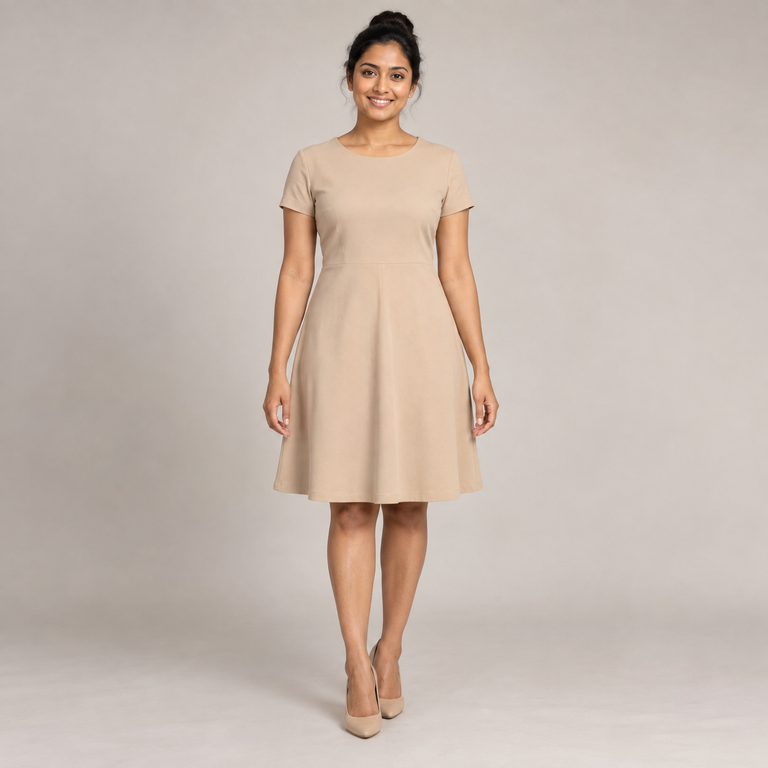
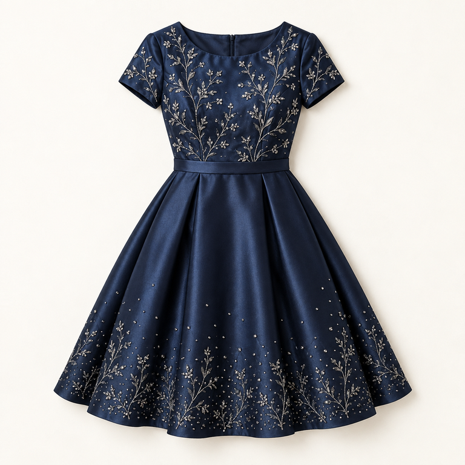
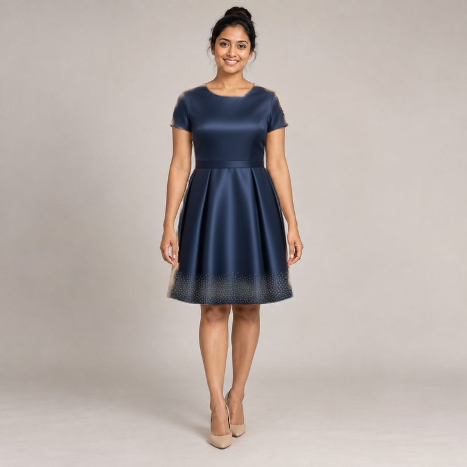

# Fictional adult: simple dress to party dress

The source and garment reference were newly generated with the built-in OpenAI image-generation tool on 2026-09-26, with no input photographs. The adult is fictional; no client or private model image was used. The Qwen result is a separate, actual local inference output.

| Before: synthetic source | Synthetic garment reference | After: actual Qwen result |
| :---: | :---: | :---: |
|  |  |  |

## Reproduce the example

Use the [public UI workflow](../workflows/low-budget/Qwen_Fashion_Edit_3060.json). Load `human-source-masked.png` in source node 1 and `human-reference.png` in reference node 2. The source RGB is stored underneath its alpha channel; ComfyUI LoadImage turns transparency into the edit mask. `human-mask.png` is a viewable version: white means edit, black means preserve. This is a hand-defined binary polygon mask, not automatic clothing detection.

Use the instruction in [human-test-api.json](human-test-api.json). That file is the actual submitted server API graph, not the drag-and-drop UI format. Baseline node links, model choices and sampler settings were retained; only input names, edit instruction and output filename prefix changed.

The input assets were resized to 768 × 768. The working-resolution setting stayed at 0.5 megapixels. The result is not retouched. See [the measured report](../docs/human-validation.md) for timing, pixel checks and visual limitations. The [earlier mannequin test](README.md) remains available.

## Source generation prompt

Use case: photorealistic-natural. Create a single original synthetic fashion catalogue photograph for a public AI garment-editing test. A fully fictional adult woman age 30, medium brown skin, dark hair neatly tied up, standing front-facing with a natural relaxed smile, full body visible head to shoes. Wearing a simple plain matte beige short-sleeve round-neck knee-length A-line everyday dress and neutral closed-toe heels. Arms relaxed slightly away from torso, hands clearly visible outside dress silhouette, no overlapping hair or accessories over garment. Neutral warm light gray studio background, soft even realistic lighting, natural human proportions and skin texture. Square image with comfortable margins, subject centered and occupying 85 percent of height. No real person likeness, no client references, no logos, no text, no collage, no before-after. Generate just the source image, not a transformation.

## Reference generation prompt

Use case: product-mockup. Create one original synthetic product photograph of an elegant midnight-blue party dress, front-facing flat lay on a light ivory studio background. Short sleeves, round neckline, fitted bodice, defined waist with narrow matching satin waistband, knee-length flared A-line skirt. Rich midnight-blue satin with subtle embroidered silver botanical details on bodice and scattered delicate sparkling embellishments at skirt hem. Fully lined opaque fabric, refined evening-party fashion. Entire dress centered visible with generous margins in a square image. Realistic fabric folds and stitching, soft studio light. No person, no mannequin, no hanger, no text, no logos, no collage. This standalone garment is a reference input for a real local Qwen fashion-edit workflow test.
